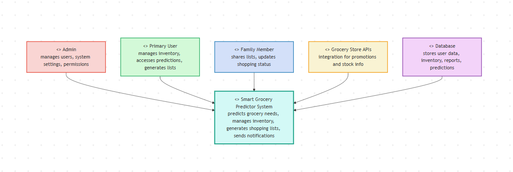

#

# Software Requirements Specification (SRS)

# Smart Grocery Prediction System

----------

# Revision History

-   Version 1.0 – Initial draft
-   Version 1.1 – Added AI prediction and analytics details
-   Version 1.2 – Updated cloud deployment and integration notes

----------

# 1. Introduction

## Purpose

The Smart Grocery Prediction System (SGPS) is a cloud-based intelligent application that helps users plan and manage grocery shopping efficiently. Using AI and predictive analytics, the system forecasts grocery needs, monitors inventory, and recommends purchases, reducing waste and saving money.

## Scope

The system provides:

-   AI-based grocery predictions using purchase history and consumption trends
-   Inventory management with alerts for low stock and expiration
-   Personalized shopping recommendations
-   Automated and shareable shopping lists
-   Budget tracking and reporting
-   Notifications for deals, low stock, and expiration
-   Analytics dashboard to visualize spending and consumption trends
-   Multi-device access, web and mobile

## Intended Audience

-   Developers and AI engineers for system implementation
-   Project managers for scope and planning
-   Testers and QA teams for validation
-   End users managing grocery shopping

## References

-   IEEE 830-1998 Software Requirements Specification
-   AI recommendation system guidelines
-   GDPR and data privacy regulations
-   Cloud deployment documentation

----------

# 2. Overall Description

## Product Perspective

The system is a standalone web and mobile-friendly application that can integrate with:

-   Online grocery stores
-   Payment gateways
-   Smart home devices (e.g., smart fridges)
-   Barcode scanners and receipt scanners

## Product Functions

-   **Grocery Prediction**: Forecasts future grocery needs using AI models
-   **Inventory Management**: Tracks stock, expiration dates, and usage patterns
-   **Recommendation Engine**: Suggests frequently purchased items, budget-friendly alternatives, and healthier options
-   **Shopping List Management**: Generates AI-driven lists and allows manual list creation; supports sharing with family
-   **Budget Tracking**: Monitors expenses, generates weekly/monthly reports
-   **Notifications**: Alerts for low stock, expiring items, shortages, and promotions
-   **Analytics Dashboard**: Visualizes spending trends, consumption patterns, and AI prediction accuracy

## User Classes and Characteristics

-   **Admin**: Manages users, monitors system health, and oversees AI performance
-   **Primary User**: Adds inventory, receives predictions, manages shopping lists and budget
-   **Family Member**: Accesses shared lists, updates item status, and participates in inventory management

## Operating Environment

-   Web browsers: Chrome, Firefox, Edge, Safari
-   Mobile browsers: Android and iOS
-   Cloud-based deployment on AWS/Azure/GCP
-   Databases: MongoDB or PostgreSQL
-   Notification services: Email, SMS, push notifications

## Design and Implementation Constraints

-   Must comply with GDPR and data privacy regulations
-   AI models must achieve at least 85% prediction accuracy
-   Cloud architecture must be scalable and modular
-   Mobile-responsive UI design

## Assumptions and Dependencies

-   Users have stable internet access
-   Users regularly update inventory data
-   External APIs may be needed for grocery store integration

----------

# 3. System Requirements

## Functional Requirements

-   **User Authentication**: Register, login, reset passwords, email verification, multi-factor authentication, role-based access control
-   **Inventory Management**: Add, update, remove items; track expiration and low stock; record usage frequency
-   **Grocery Prediction**: AI analyzes purchase history, seasonal trends, and consumption; generates predicted shopping lists; improves over time with machine learning
-   **Recommendation Engine**: Suggest frequently bought, budget-friendly, or healthier alternatives; may integrate store promotions
-   **Shopping List Management**: Auto-generate AI-driven lists, create manual lists, share with family, categorize items by type
-   **Notifications**: Alerts for low stock, expiring products, predicted shortages; via email, SMS, or push
-   **Analytics & Reporting**: Expense, consumption, and prediction accuracy reports; exportable in PDF or CSV
-   **Barcode and Receipt Scanning (Optional)**: Add items using barcode or OCR receipt scanning; update inventory automatically

## Non-Functional Requirements

-   **Performance**: Support 2000+ concurrent users; AI predictions generated in ≤ 4 seconds; real-time inventory updates
-   **Security**: Encrypt sensitive user data; secure authentication protocols; role-based access control; GDPR compliance
-   **Usability**: Intuitive interface, mobile-responsive, accessible (WCAG 2.1 compliant)
-   **Reliability and Availability**: 99.95% uptime; automated failure recovery; daily backups
-   **Maintainability**: Modular architecture; AI models updatable without affecting the entire system; logging for debugging
-   **Scalability**: Horizontal scaling for enterprise-level expansion
-   **Portability**: Works on Windows, macOS, Linux, Android, iOS browsers

----------

# 4. System Models

> * **CONTEXT DIAGRAM**

**Context:** Users interact with the system, AI prediction engine, notification services, grocery store APIs, and payment systems.

**Activity Flow:**

-   User logs in
-   Adds or updates inventory
-   AI engine analyzes data
-   Predictions generated
-   Shopping list created
-   Notifications sent

**Use Cases:**

-   Admin: Manage users, view analytics, monitor AI performance
-   User: Manage inventory, view predictions, generate shopping lists, track expenses
-   Family Member: Access shared lists, update shopping status

**Sequence Flow:**

-   User enters inventory
-   System stores data in database
-   AI engine processes data
-   Predictions returned
-   Notifications sent

**Entities:** User, GroceryItem, Inventory, ShoppingList, Prediction, Expense, Notification  
**Relationships:** One user can have multiple shopping lists; inventory contains multiple items; predictions link to purchase history

**Item States:** Added → In Stock → Low Stock → Expiring → Out of Stock → Purchased

----------

# 5. System Evolution

-   Future integration with voice assistants
-   IoT smart fridge connectivity
-   Personalized nutrition recommendations
-   Real-time price comparison
-   Wearable device integration for dietary tracking

----------

# 6. Appendices

**Hardware Requirements:** Cloud servers, load balancers, backup storage systems

**Software Requirements:** Frontend – React.js / Vue.js; Backend – Node.js / Django; Database – MongoDB / PostgreSQL; AI – TensorFlow / PyTorch

**Database Requirements:** Secure storage of user and inventory data; logical relationships; real-time synchronization; large-scale transactional support
